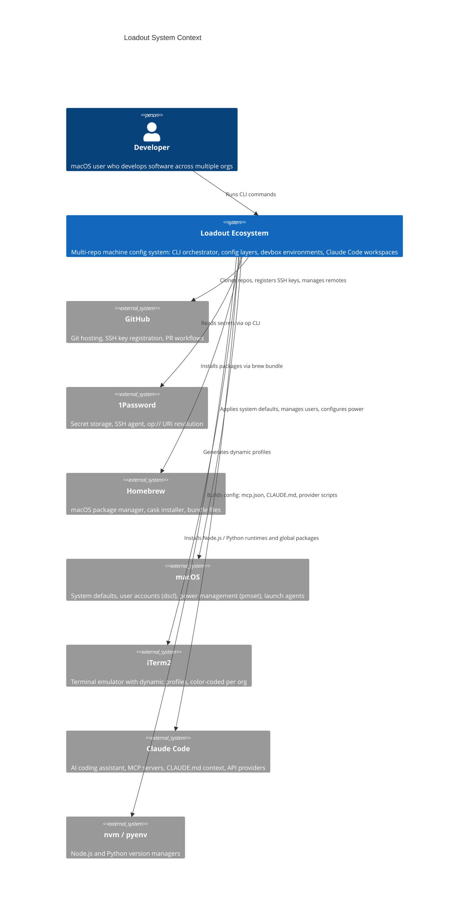
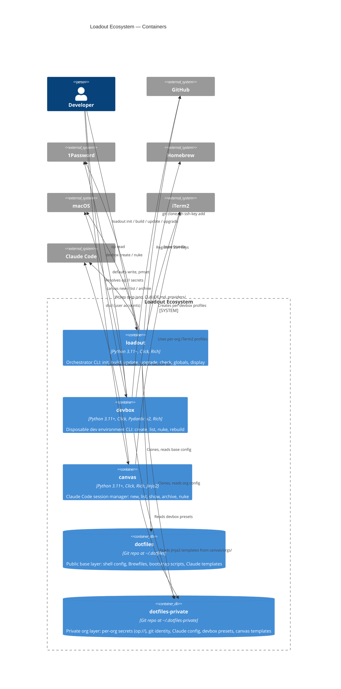
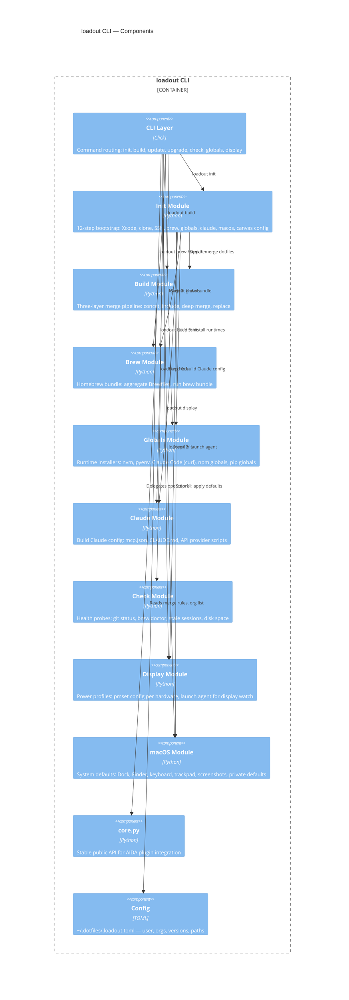
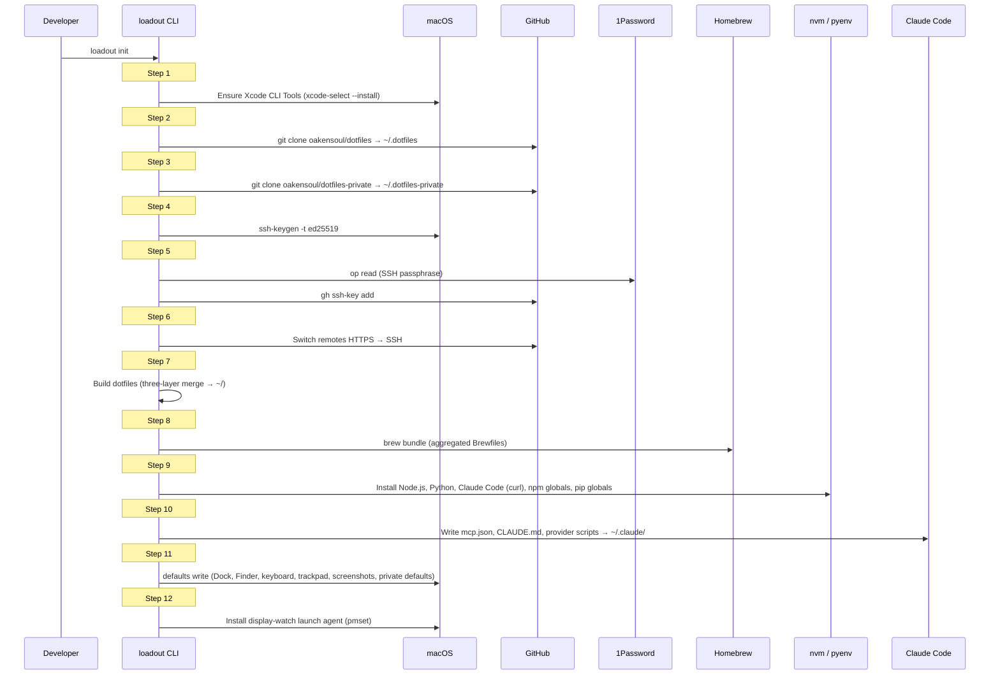
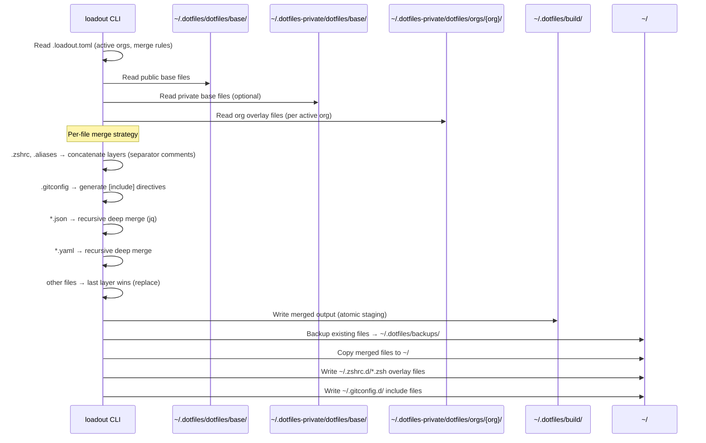
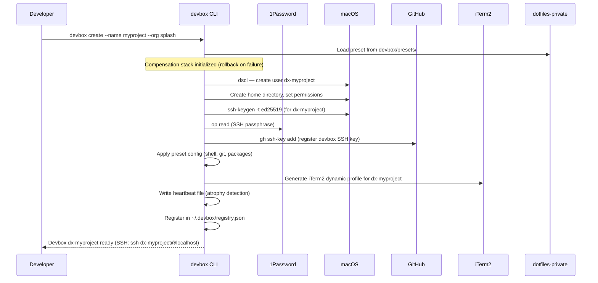
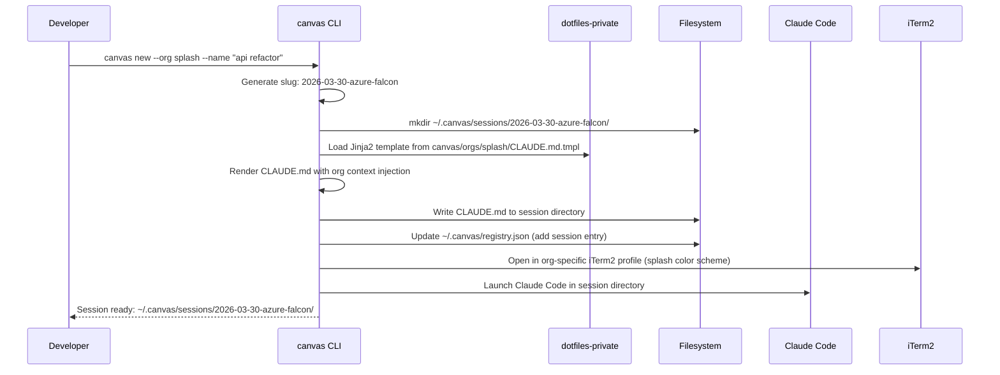

# Loadout Ecosystem Architecture

> C4 architecture documentation for the Loadout multi-repo macOS machine configuration system.
>
> Version: 0.1.0 | Last updated: 2026-03-31
>
> For getting started, see the [Setup Guide](../SETUP.md).

---

## Table of Contents

1. [System Context (C4 Level 1)](#1-system-context-c4-level-1)
2. [Container Diagram (C4 Level 2)](#2-container-diagram-c4-level-2)
3. [Component Diagram (C4 Level 3)](#3-component-diagram-c4-level-3)
4. [Data Flow Diagrams](#4-data-flow-diagrams)
5. [Merge Strategy Details](#5-merge-strategy-details)
6. [State and Storage](#6-state-and-storage)
7. [Multi-Org Model](#7-multi-org-model)
8. [Glossary](#8-glossary)

---

## 1. System Context (C4 Level 1)

The Loadout system configures and maintains macOS development machines. It interacts with several external systems to install software, manage secrets, provide visual identity, and enable AI-assisted development.

---

## 2. Container Diagram (C4 Level 2)

The ecosystem spans five repositories. Three are Python CLIs (loadout, devbox, canvas) and two are configuration repositories (dotfiles, dotfiles-private). The loadout CLI orchestrates everything; devbox and canvas are specialized tools that share infrastructure.

### Container Summary

| Container | Repo | Type | Version | Key Responsibility |
|---|---|---|---|---|
| **loadout** | `oakensoul/loadout` | Python CLI | v0.1.0 Beta | Machine bootstrap and ongoing maintenance |
| **dotfiles** | `oakensoul/dotfiles` (this repo) | Config repo | n/a | Public base layer — universal macOS defaults |
| **dotfiles-private** | `oakensoul/dotfiles-private` | Config repo | n/a | Private org layer — secrets, identity, overrides |
| **devbox** | `oakensoul/devbox` | Python CLI | v0.1.0 Alpha | Disposable SSH-only dev environments |
| **canvas** | `oakensoul/canvas` | Python CLI | v0.1.0 Alpha | Ephemeral Claude Code workspaces |

---

## 3. Component Diagram (C4 Level 3)

Internal architecture of the **loadout** orchestrator CLI.

---

## 4. Data Flow Diagrams

### 4.1 loadout init (Bootstrap Flow)

### 4.2 loadout build (Merge Pipeline)

### 4.3 devbox create (Environment Provisioning)

### 4.4 canvas new (Session Creation)

---

## 5. Merge Strategy Details

The `loadout build` command merges dotfiles from three layers in priority order. Later layers override earlier ones.

### Layer Priority (lowest to highest)

| Priority | Layer | Source Path |
|---|---|---|
| 1 (base) | Public base | `~/.dotfiles/dotfiles/base/` |
| 2 | Private base | `~/.dotfiles-private/dotfiles/base/` |
| 3 (highest) | Org overlays | `~/.dotfiles-private/dotfiles/orgs/{org}/` |

### Merge Strategy by File Type

| File Pattern | Strategy | Behavior |
|---|---|---|
| `.zshrc` | Concatenation | Layers appended sequentially, separated by comment markers (`# --- layer: base ---`) |
| `.aliases` | Concatenation | Same as `.zshrc` — all aliases from all layers combined |
| `.zprofile` | Concatenation | Same as `.zshrc` |
| `.zshenv` | Concatenation | Same as `.zshrc` |
| `.gitconfig` | Include directives | Each layer written to `~/.gitconfig.d/{layer}.gitconfig`; root `.gitconfig` uses `[include]` to load them in order |
| `*.json` | Recursive deep merge | Objects merged recursively; arrays replaced; later layers win on key conflicts |
| `*.yaml`, `*.yml` | Recursive deep merge | Same as JSON — recursive object merge, later layers win |
| All other files | Replace | Last layer providing the file wins entirely |

### Overlay Hook System

Beyond the merge pipeline, Loadout installs overlay hooks that allow runtime customization without rebuilding:

| Hook | Location | Purpose |
|---|---|---|
| `~/.zshrc.d/*.zsh` | Numeric-prefix ordered | `10-*` org config, `50-*` devbox, `90-*` private overrides |
| `~/.gitconfig.d/` | Include-loaded | Per-org git configs with conditional includes |
| `~/.zshrc.local` | Sourced last | Machine-specific shell overrides (not managed by loadout) |
| `~/.gitconfig.local` | Included last | Machine-specific git overrides (not managed by loadout) |

---

## 6. State and Storage

Each tool maintains its own state directory. There are no shared databases — tools communicate through the filesystem and well-known paths.

| Path | Owner | Contents |
|---|---|---|
| `~/.dotfiles/` | loadout (git) | Public base config repo (this repo) |
| `~/.dotfiles-private/` | loadout (git) | Private org config repo |
| `~/.dotfiles/.loadout.toml` | loadout | Primary config: user identity, active orgs, tool versions, paths |
| `~/.dotfiles/build/` | loadout | Merged build output (staging area before copy to `~/`) |
| `~/.dotfiles/backups/` | loadout | Timestamped backups of files before overwrite |
| `~/.loadout/` | loadout | Runtime state: `logs/`, `backups/`, timestamps, future `manifest.json` |
| `~/.devbox/` | devbox | `config.json`, `registry.json` (devbox inventory and settings) |
| `~/.canvas/` | canvas | `config`, `registry.json` (session inventory), `sessions/` (workspace dirs) |
| `~/.claude/` | loadout / canvas | `mcp.json`, `CLAUDE.md`, `providers/` (API key scripts) |
| `~/Library/Application Support/iTerm2/DynamicProfiles/` | loadout / devbox / canvas | Generated iTerm2 dynamic profile JSON files |

### State Ownership Rules

- **loadout** is the sole writer of `~/.dotfiles/`, `~/.dotfiles-private/`, and merged output in `~/`.
- **devbox** manages macOS user accounts and `~/.devbox/` state. It reads presets from `~/.dotfiles-private/` but never writes to it.
- **canvas** manages `~/.canvas/` state. It reads Jinja2 templates from `~/.dotfiles-private/` but never writes to it.
- **loadout check** reads state from all three tools to report health.

---

## 7. Multi-Org Model

Loadout supports five organizations, each receiving isolated configuration across every tool.

### Supported Organizations

| Org Slug | Purpose |
|---|---|
| `personal` | Personal projects and default identity |
| `splash` | Primary employer |
| `mythical-journeys` | Side project |
| `sidequest-syndicate` | Side project collective |
| `equinox-consulting` | Consulting work |

### Per-Org Configuration Surface

| Concern | Mechanism | Location |
|---|---|---|
| **Git identity** | Conditional includes in `.gitconfig` | `~/.gitconfig.d/{org}.gitconfig` |
| **Shell globals** | Sourced via `~/.zshrc.d/10-{org}.zsh` | `dotfiles-private/globals/orgs/{org}/` |
| **Brewfile extensions** | Aggregated by `loadout brew` | `dotfiles-private/brewfiles/orgs/{org}/Brewfile` |
| **Claude Code config** | Per-org `CLAUDE.md`, MCP servers, API providers | `dotfiles-private/claude/orgs/{org}/` |
| **Devbox presets** | Preset JSON loaded by `devbox create --org` | `dotfiles-private/devbox/presets/{org}/` |
| **Canvas templates** | Jinja2 `CLAUDE.md.tmpl` rendered per session | `dotfiles-private/canvas/orgs/{org}/CLAUDE.md.tmpl` |
| **iTerm2 profiles** | Color-coded dynamic profiles per org | Generated at runtime; colors identify org visually |
| **Secrets** | `op://` references scoped per org vault | `dotfiles-private/globals/orgs/{org}/` |

### Org Resolution

1. `loadout init` prompts for active orgs, writes to `.loadout.toml`.
2. `loadout build` iterates active orgs, merging their overlays in order.
3. `devbox create --org <slug>` loads the matching preset.
4. `canvas new --org <slug>` selects the matching Jinja2 template and iTerm2 profile.

---

## 8. Glossary

| Term | Definition |
|---|---|
| **Base layer** | The public `dotfiles` repo containing universal macOS defaults. First (lowest priority) merge layer. |
| **Org layer** | Per-organization configuration in `dotfiles-private`. Overrides the base layer. |
| **Private layer** | The combination of `dotfiles-private/dotfiles/base/` and org overlays. Higher priority than public base. |
| **Overlay hook** | A well-known file path (`~/.zshrc.d/`, `~/.gitconfig.d/`, `~/.zshrc.local`) that allows runtime customization without rebuilding. |
| **Three-layer merge** | The build pipeline that combines public base, private base, and org overlays into final dotfiles. |
| **Loadout** | Both the ecosystem name and the orchestrator CLI (`oakensoul/loadout`). |
| **Devbox** | A disposable SSH-only macOS user account (prefixed `dx-`) for project-scoped development. |
| **Canvas** | An ephemeral Claude Code workspace — a dated directory with rendered context and session tracking. |
| **Slug** | A human-friendly identifier. Canvas uses `YYYY-MM-DD-adjective-noun` format. |
| **Preset** | A JSON configuration file in `dotfiles-private` that defines a devbox environment (packages, shell config, git identity). |
| **Provider script** | A shell script in `~/.claude/providers/` that outputs a Claude Code API key, typically via `op read`. |
| **Compensation stack** | Devbox's rollback mechanism — records each provisioning step so partial failures can be cleanly reversed. |
| **Heartbeat file** | A timestamp file in a devbox home directory, updated on activity. Used for atrophy detection (stale devbox cleanup). |
| **Atrophy detection** | Health check that identifies devbox environments with no recent activity, candidates for `devbox nuke`. |
| **`op://` URI** | A 1Password CLI reference (e.g., `op://vault/item/field`) resolved at runtime by `op read`. No secrets are stored in config files. |
| **Dynamic profile** | An iTerm2 feature where JSON files in `~/Library/Application Support/iTerm2/DynamicProfiles/` are auto-loaded as terminal profiles. |
| **AIDA** | A future plugin system. All three Python CLIs expose `core.py` stable APIs for AIDA integration. |
| **`loadout check`** | Health probe command that inspects git status, brew state, stale canvas sessions, devbox heartbeats, and disk space. |
| **Atomic swap** | The build module writes merged output to a staging directory (`~/.dotfiles/build/`) then copies to `~/`, minimizing the window of inconsistent state. |
